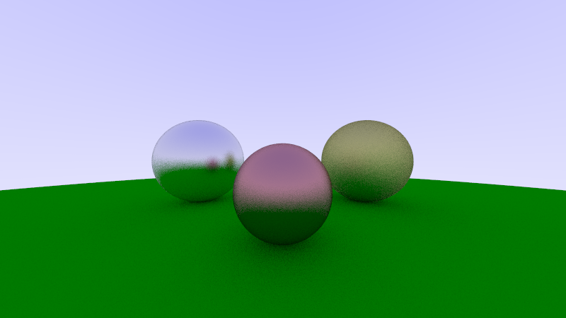

# Ray_Tracer

This is a practice game renderer using ray tracing techniques to create 3D images. The project is created on Visual Studio 2019 and the language used is C++.

# Preview

## Specific setup used:
```ruby

//Rendering settings
int samples = 50;
int max_bounces=30;

//Set the scene
//Add the objects in the scene
obj_list scene;

shared_ptr<lambertian> ground_mat = make_shared<lambertian>(color(0, 0.4, 0));
shared_ptr<metal> mid_sphere_mat = make_shared<metal>(color(0.6, 0.3, 0.3),0.5);
shared_ptr<metal> left_sphere_mat = make_shared<metal>(color(0.8, 0.8, 0.8), 0.3);
shared_ptr<metal> right_sphere_mat = make_shared<metal>(color(0.6, 0.6, 0.2), 1.0);

scene.add(make_shared<sphere>(point3(0, -100.5, -1), 100, ground_mat));
scene.add(make_shared<sphere>(point3(0, -0.2, -1), 0.3, mid_sphere_mat));
scene.add(make_shared<sphere>(point3(1, -0.02, -2), 0.5, right_sphere_mat));
scene.add(make_shared<sphere>(point3(-1, -0.02, -2), 0.5, left_sphere_mat));
```
## Output:


